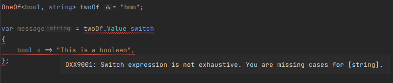

# OneOf\<T> exhaustive switch expression analyzer

This analyzer will warn you if you have a switch expression on a `OneOf<T>.Value` that is not exhaustive or is checking for impossible cases.

## [Missing cases Analyzer](OneOfExhaustiveSwitchExpressionMissingCasesAnalyzer.cs)




## [Impossible cases Analyzer](OneOfExhaustiveSwitchExpressionImpossibleCasesAnalyzer.cs)


## [Missing cases Code Fix](OneOfExhaustiveSwitchExpressionMissingCasesCodeFixProvider.cs)


## [Impossible cases Code Fix](OneOfExhaustiveSwitchExpressionImpossibleCasesCodeFixProvider.cs)


## [Diagnostic Suppressor](OneOfExhaustiveSwitchExpressionDiagnosticSuppressor.cs)

Suppresses [CS8509](https://learn.microsoft.com/en-us/dotnet/csharp/language-reference/compiler-messages/pattern-matching-warnings) for all switch expressions on `OneOf<T>.Value`.


## Known Issues

- The analyzer will detect literal values as the type itself, and will not report missing cases for their type.
  - For example, with the following code:
    ```csharp
    OneOf<bool, string> stringOrBool = "Test";
    var message = stringOrBool.Value switch
    {
        true => "This is a bool",
        "A string" => "lol",
    };
    ```
    The analyzer will report no missing cases here, as both a bool and a string are present.
    This is clearly wrong, as even this simple example will throw a [SwitchExpressionException](https://learn.microsoft.com/en-us/dotnet/api/system.runtime.compilerservices.switchexpressionexception)

## Future Plans

- I might move the Discard Pattern to a separate analyzer(OXX9003), as it's more or a design choice than a bug.

- Code Fixer to convert `OneOf<T>.Match` to `OneOf<T>.Value` switch expression
  - For example, look at the following code:
    ```csharp
    OneOf<NotFound, string> maybeString = "Test";
    
    var message = maybeString.Match(
        x => throw new NotImplementedException(),
        x => value
    );
    
    /* Apply Code Fix */
    
    OneOf<NotFound, string> maybeString = "Test";
    
    var message = maybeString.Value switch
    {
        NotFound x => throw new NotImplementedException(),
        string x => value,
    };
    ```
    This improves readability and maintainability, as the `Match` method is based on the order of the types, and not the types themselves.
    So if you don't use the extracted variable - or the variable works with multiple types - you might not notice that the order of the types is wrong which could lead to bugs.


- Code Fixer to convert methods that throws exceptions to `OneOf<T>.Value` switch expression
  - For example, look at the following code:
    ```csharp
    public void MethodThatThrows()
    {
        if (<SomeCondition>)
        {
            throw new MyCustomException("This is an exception");
        }
        // Logic goes here
    }
    
    /* Apply Code Fix */
    
    public OneOf<Success, MyCustomException> MethodThatThrows()
    {
        if (<SomeCondition>)
        {
            return new MyCustomException("This is an exception");
        }
        // Logic goes here
        return new Success();
    }
    ```
    This will allow you to use the `OneOf<T>.Value` switch expression to handle the exception, instead of having to use a try-catch block that you might forget to add, or might swallow up more exceptions than you intended.