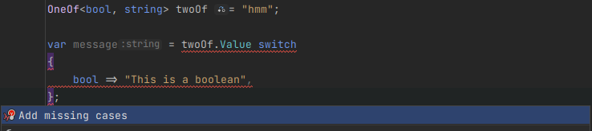
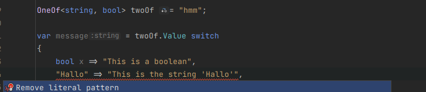
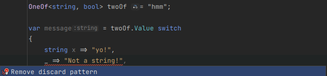
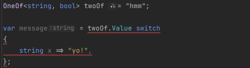

# [OneOf\<T>](https://github.com/mcintyre321/OneOf) switch expression analyzer

This analyzer will warn you if you have a switch expression on a `OneOf<T>.Value` that is not exhaustive or is checking for impossible cases.

---

## [Missing cases Analyzer](OneOfSwitchExpressionMissingCasesAnalyzer.cs)


### [Code Fix](OneOfSwitchExpressionMissingCasesCodeFixProvider.cs)



---

## [Impossible cases Analyzer](OneOfSwitchExpressionImpossibleCasesAnalyzer.cs)


#### Literal


### [Code Fix](OneOfSwitchExpressionImpossibleCasesCodeFixProvider.cs)


#### Literal




---

## [Discard Pattern Analyzer](OneOfSwitchExpressionDiscardPatternAnalyzer.cs)


### [Code Fix](OneOfSwitchExpressionDiscardPatternCodeFixProvider.cs)




---

## [Diagnostic Suppressor](OneOfSwitchExpressionDiagnosticSuppressor.cs)

Suppresses [CS8509](https://learn.microsoft.com/en-us/dotnet/csharp/language-reference/compiler-messages/pattern-matching-warnings) for all switch expressions on `OneOf<T>.Value`.

---

## Known Issues

- None at the moment

## Future Plans

- Support [`OneOfBase<T>`](https://github.com/mcintyre321/OneOf)

- Code Fixer to convert `OneOf<T>.Match` to `OneOf<T>.Value` switch expression
  - For example, look at the following code:
    ```csharp
    OneOf<NotFound, string> maybeString = "Test";
    
    var message = maybeString.Match(
        x => throw new NotImplementedException(),
        x => value
    );
    
    /* Apply Code Fix */
    
    OneOf<NotFound, string> maybeString = "Test";
    
    var message = maybeString.Value switch
    {
        NotFound x => throw new NotImplementedException(),
        string x => value,
    };
    ```
    This improves readability and maintainability, as the `Match` method is based on the order of the types, and not the types themselves.
    So if you don't use the extracted variable - or the variable works with multiple types - you might not notice that the order of the types is wrong which could lead to bugs.


- Code Fixer to convert methods that throws exceptions to `OneOf<T>.Value` switch expression
  - For example, look at the following code:
    ```csharp
    public void MethodThatThrows()
    {
        if (<SomeCondition>)
        {
            throw new MyCustomException("This is an exception");
        }
        // Logic goes here
    }
    
    /* Apply Code Fix */
    
    public OneOf<Success, MyCustomException> MethodThatThrows()
    {
        if (<SomeCondition>)
        {
            return new MyCustomException("This is an exception");
        }
        // Logic goes here
        return new Success();
    }
    ```
    This will allow you to use the `OneOf<T>.Value` switch expression to handle the exception, instead of having to use a try-catch block that you might forget to add, or might swallow up more exceptions than you intended.
