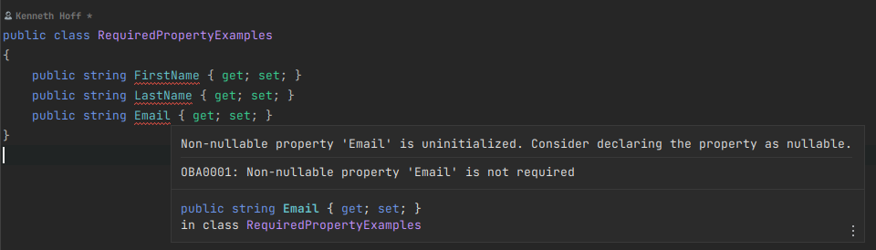
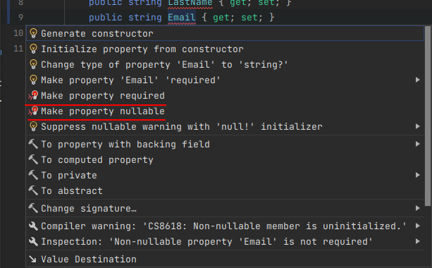

# Oxx.Backend.Analyzers

## Roslyn Analyzers
A .NET Standard project with implementations of sample analyzers and code fix providers.

- [RequiredPropertyAnalyzer.cs](Oxx.Backend.Analyzers/Oxx.Backend.Analyzers/RequiredPropertyAnalyzer.cs): An analyzer that reports non-nullable properties that are not required.
    
- [RequiredPropertyCodeFixProvider.cs](Oxx.Backend.Analyzers/Oxx.Backend.Analyzers/RequiredPropertyCodeFixProvider.cs): Adds two code fixers to the RequiredPropertyAnalyzer that either:
  - Adds the `required` keyword to the property.
  - Makes the property nullable.

    

### How to use

1. Add the NuGet package to your project.
2. ???
3. Profit!

#### Modify the severity of the analyzer

By default, all analyzers are configured to report `warning`s. 

If you have the msbuild property `<TreatWarningsAsErrors>true</TreatWarningsAsErrors>` set(which you should), then all analyzers will report as errors.

If you want to change the severity of any analyzer(From this package or otherwise), you can do so in your project's `.editorconfig` file.

```editorconfig
# Set the severity of the `RequiredPropertyAnalyzer`(OXX0001) to `none`. This will disable the analyzer and code fixers.
dotnet_diagnostic.OXX0001.severity = none

# Set the severity of the `RequiredPropertyAnalyzer`(OXX0001) to `error`. This will cause the analyzer to report an error.
dotnet_diagnostic.OXX0001.severity = error
```

See [here](https://learn.microsoft.com/en-us/dotnet/fundamentals/code-analysis/configuration-options) for more information, but be aware that not everything in that document is supported by Rider.

## Source Generators

There aren't any 🤷🏻

### For contributors

If, after cloning this repository, you do _not_ see the analyzer warnings in the IDE, you may need to build the project first.