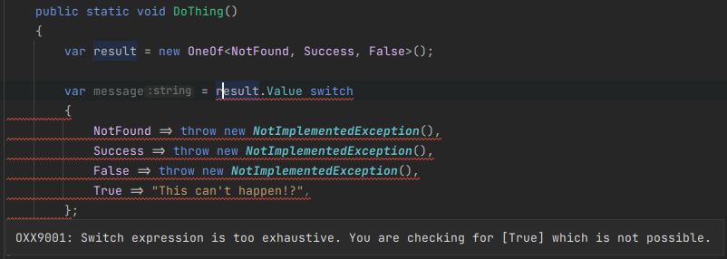
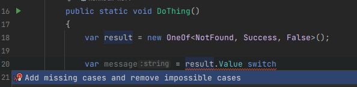
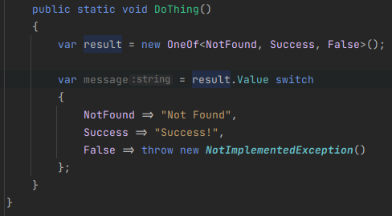

# OneOf\<T> exhaustive switch expression analyzer

This analyzer will warn you if you have a switch expression on a `OneOf<T>` that is not exhaustive.

## [Analyzer](OneOfExhaustiveSwitchExpressionAnalyzer.cs)

## [Code Fix](OneOfExhaustiveSwitchExpressionCodeFixProvider.cs)

### Add missing cases

### Fixed

## [Diagnostic Suppressor](OneOfExhaustiveSwitchExpressionDiagnosticSuppressor.cs)

Suppresses [CS8509](https://learn.microsoft.com/en-us/dotnet/csharp/language-reference/compiler-messages/pattern-matching-warnings) for all switch expressions on `OneOf<T>`.