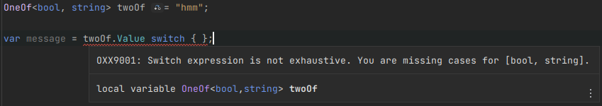
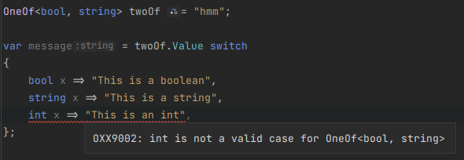
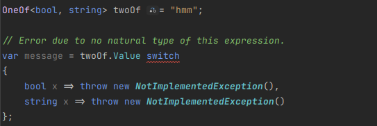

# OneOf\<T> exhaustive switch expression analyzer

This analyzer will warn you if you have a switch expression on a `OneOf<T>.Value` that is not exhaustive or is checking for impossible cases.

## [Missing cases Analyzer](OneOfExhaustiveSwitchExpressionMissingCasesAnalyzer.cs)

## [Impossible cases Analyzer](OneOfExhaustiveSwitchExpressionImpossibleCasesAnalyzer.cs)

## [Missing cases Code Fix](OneOfExhaustiveSwitchExpressionMissingCasesCodeFixProvider.cs)

## [Impossible cases Code Fix](OneOfExhaustiveSwitchExpressionImpossibleCasesCodeFixProvider.cs)

## [Diagnostic Suppressor](OneOfExhaustiveSwitchExpressionDiagnosticSuppressor.cs)

Suppresses [CS8509](https://learn.microsoft.com/en-us/dotnet/csharp/language-reference/compiler-messages/pattern-matching-warnings) for all switch expressions on `OneOf<T>.Value`.