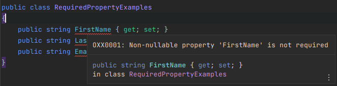
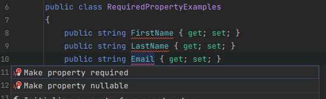
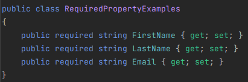
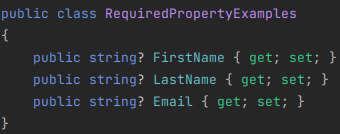

# Required Property Analyzer

This analyzer ensures all properties are either required or nullable. This is to prevent the use of the default value for a property, which can lead to unexpected behavior.

## [Analyzer](RequiredPropertyAnalyzer.cs)

## [Code Fix](RequiredPropertyCodeFixProvider.cs)

### Make property required

### Make property nullable

## [Diagnostic Suppressor](RequiredPropertyDiagnosticSuppressor.cs)
Suppresses [CS8618](https://learn.microsoft.com/en-us/dotnet/csharp/language-reference/compiler-messages/nullable-warnings#nonnullable-reference-not-initialized) for all properties.